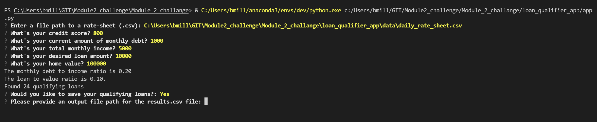
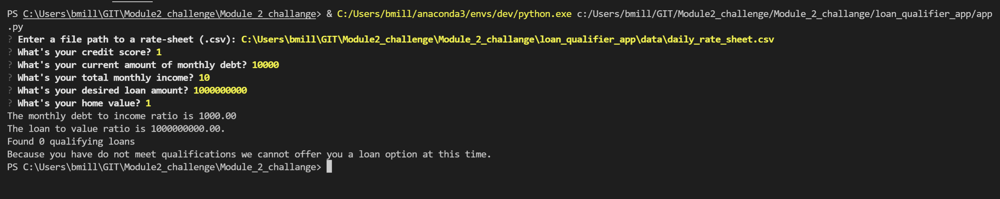
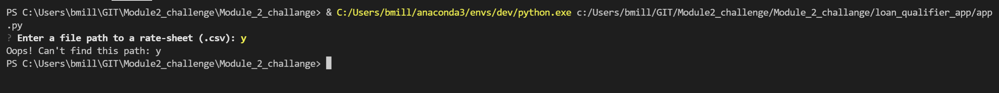
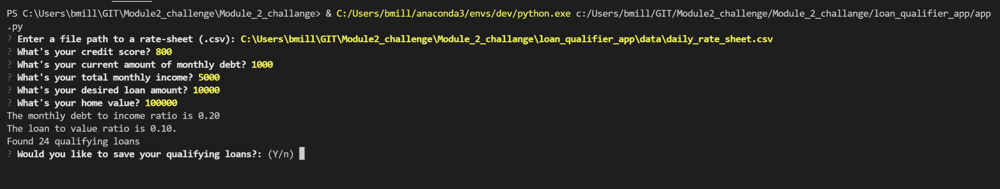
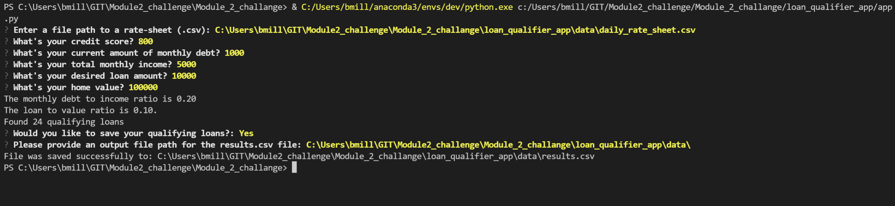
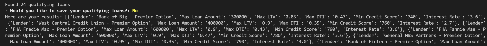
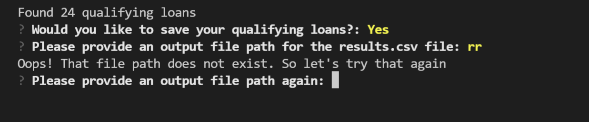
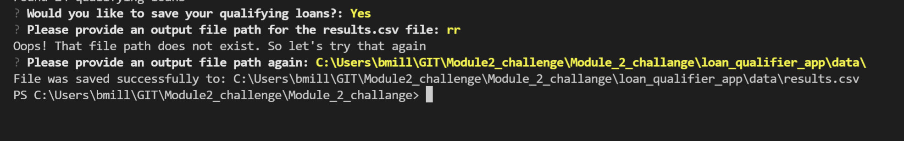

# Loan Qualifier Application [Module assignment for FinTech Bootcamp]

This is a python command-line interface application that allows users to see qualifying loans from lenders quickly and easily. The application works by taking in a `daily_rate_sheet` of loan criteria from various loan providers, asking the user a number of questions to evaluate their loan eligibility, and then returning to them a list of qualifying loans which is provided saved as `results` or printed to screen.

---

## Technologies

This project leverages python 3.8.8 with the following packages:

* [fire](https://github.com/google/python-fire) - For the command line interface, help page, and entrypoint.

* [questionary](https://github.com/tmbo/questionary) - For interactive user prompts and dialogs

* [sys](https://docs.python.org/3.8/library/sys.html) - Information about this library.

* [os](https://docs.python.org/3.8/library/os.html) - Information about this library.

* [csv](https://docs.python.org/3.8/library/csv.html) - Information about this library.

* [pathlib](https://docs.python.org/3.8/library/pathlib.html) - Information about this library.
---

## Installation Guide

```python
  pip install fire
  pip install questionary

  The other libraries should be part of the standard Python installation. 
```

---

---

## Usage

To use the loan qualifier application simply clone the repository and run the **app.py** with:

```python
python app.py
```

Upon launching the loan qualifier application you will be greeted with the following prompts.










* It is important the borrower furnish accurate information so that the filters provide an optimal list of banks that the borrower may qualify to submit a loan application.
* The five questions are as follows:

? What's your credit score? 
? What's your current amount of monthly debt?
? What's your total monthly income? 
? What's your desired loan amount?
? What's your home value? 

*The output will follow the prompts already presented above. 
---

## Contributors

Brian Miller
* 

---

## License

No license required.
